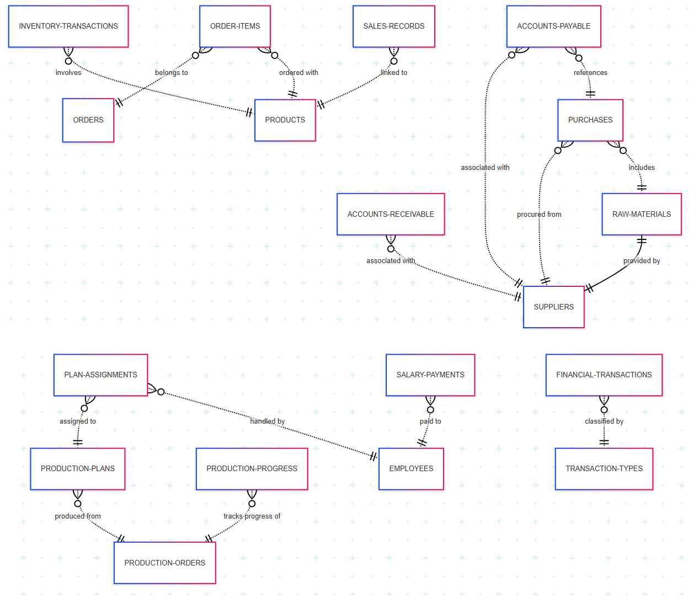

# Mermaid Code-----
```
erDiagram
    ACCOUNTS-PAYABLE }o..|| SUPPLIERS : "associated with"
    ACCOUNTS-PAYABLE }o..|| PURCHASES : "references"
    ACCOUNTS-RECEIVABLE }o..|| SUPPLIERS : "associated with"
    PURCHASES }o..|| SUPPLIERS : "procured from"
    PURCHASES }o..|| RAW-MATERIALS : "includes"
    RAW-MATERIALS ||--|| SUPPLIERS : "provided by"
    INVENTORY-TRANSACTIONS }o..|| PRODUCTS : "involves"
    ORDER-ITEMS }o..|| ORDERS : "belongs to"
    ORDER-ITEMS }o..|| PRODUCTS : "ordered with"
    PLAN-ASSIGNMENTS }o..|| PRODUCTION-PLANS : "assigned to"
    PLAN-ASSIGNMENTS }o..|| EMPLOYEES : "handled by"
    PRODUCTION-PLANS }o..|| PRODUCTION-ORDERS : "produced from"
    PRODUCTION-PROGRESS }o..|| PRODUCTION-ORDERS : "tracks progress of"
    SALARY-PAYMENTS }o..|| EMPLOYEES : "paid to"
    SALES-RECORDS }o..|| PRODUCTS : "linked to"
    FINANCIAL-TRANSACTIONS }o..|| TRANSACTION-TYPES : "classified by"
```

