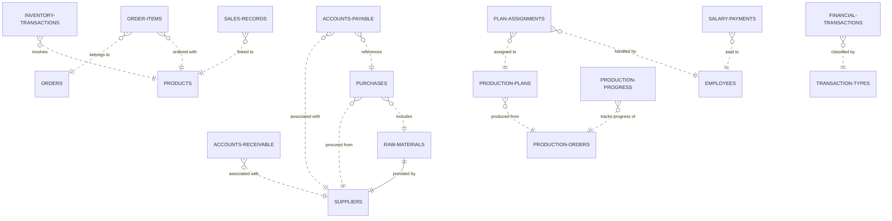

# ERD 繪製  
## 說明：
請透過以下提供之 SQL 語法，繪製出 ERD

具體工作流程：   
一、(馮冠僑、聖誕樹負責)
- 1. 將 SQL 語法丟進生成式 AI  
- 2. 生成[ Mermaid ](https://www.mermaidchart.com/play#pako:eNqrVkrOT0lVslJSqgUAFW4DVg)語法  
- 3. 將語法丟進 Mermaid 進行 ERD 生成
- 4. 由辰瑄反覆確認是否正確，確定無誤之後將 Mermaid 語法傳給 Boi

二、(曾偉倫、吳禹賢)
- 1. 將 Mermaid 所生成之圖片，重新再用[ Draw.io ](https://drive.google.com/file/d/1aLLFoObLksR2cY7VaSfvFYKJt6n_eQr6/view?usp=sharing)進行繪製
- 2. 除了實體以及關係之外，務必記得加上屬性，並加註 PK
- 3. 由辰瑄反覆確認是否正確，確定無誤之後將圖片傳給 Boi

三、(Boi)
- 1. 上傳圖片，並製作 git  
---
---
# Mermaid 
## ERD 圖片 (目前為 demo 版本，請勿直接使用)


## Mermaid Code (目前為 demo 版本，請勿直接使用)
<details>
  <summary>點我展開/收合</summary>  

```
erDiagram
    ACCOUNTS-PAYABLE }o..|| SUPPLIERS : "associated with"
    ACCOUNTS-PAYABLE }o..|| PURCHASES : "references"
    ACCOUNTS-RECEIVABLE }o..|| SUPPLIERS : "associated with"
    PURCHASES }o..|| SUPPLIERS : "procured from"
    PURCHASES }o..|| RAW-MATERIALS : "includes"
    RAW-MATERIALS ||--|| SUPPLIERS : "provided by"
    INVENTORY-TRANSACTIONS }o..|| PRODUCTS : "involves"
    ORDER-ITEMS }o..|| ORDERS : "belongs to"
    ORDER-ITEMS }o..|| PRODUCTS : "ordered with"
    PLAN-ASSIGNMENTS }o..|| PRODUCTION-PLANS : "assigned to"
    PLAN-ASSIGNMENTS }o..|| EMPLOYEES : "handled by"
    PRODUCTION-PLANS }o..|| PRODUCTION-ORDERS : "produced from"
    PRODUCTION-PROGRESS }o..|| PRODUCTION-ORDERS : "tracks progress of"
    SALARY-PAYMENTS }o..|| EMPLOYEES : "paid to"
    SALES-RECORDS }o..|| PRODUCTS : "linked to"
    FINANCIAL-TRANSACTIONS }o..|| TRANSACTION-TYPES : "classified by"
```
</details>

# SQL
<details>
  <summary>點我展開/收合</summary>

```sql
CREATE TABLE `accounts_payable` (
  `ap_id` int(11) NOT NULL,
  `supplier_id` int(11) DEFAULT NULL,
  `purchase_id` int(11) DEFAULT NULL,
  `amount` decimal(15,2) NOT NULL,
  `due_date` date DEFAULT NULL,
  `paid` tinyint(1) DEFAULT 0,
  `paid_date` date DEFAULT NULL
) ENGINE=InnoDB DEFAULT CHARSET=utf8mb4 COLLATE=utf8mb4_general_ci;

CREATE TABLE `accounts_receivable` (
  `ar_id` int(11) NOT NULL,
  `invoice_number` varchar(50) DEFAULT NULL,
  `amount` decimal(15,2) NOT NULL,
  `due_date` date DEFAULT NULL,
  `paid` tinyint(1) DEFAULT 0,
  `paid_date` date DEFAULT NULL,
  `supplier_id` int(11) DEFAULT NULL
) ENGINE=InnoDB DEFAULT CHARSET=utf8mb4 COLLATE=utf8mb4_general_ci;

CREATE TABLE `budgets` (
  `budget_id` int(11) NOT NULL,
  `year` int(11) DEFAULT NULL,
  `department` varchar(50) DEFAULT NULL,
  `budget_amount` decimal(15,2) DEFAULT NULL,
  `actual_expense` decimal(15,2) DEFAULT 0.00,
  `last_updated` date DEFAULT NULL
) ENGINE=InnoDB DEFAULT CHARSET=utf8mb4 COLLATE=utf8mb4_general_ci;

CREATE TABLE `customers` (
  `customer_id` int(11) NOT NULL,
  `customer_name` varchar(100) NOT NULL,
  `phone_number` varchar(20) DEFAULT NULL,
  `email` varchar(100) DEFAULT NULL,
  `address` varchar(255) DEFAULT NULL,
  `created_at` timestamp NOT NULL DEFAULT current_timestamp()
) ENGINE=InnoDB DEFAULT CHARSET=utf8mb4 COLLATE=utf8mb4_general_ci;

CREATE TABLE `employees` (
  `employee_id` int(11) NOT NULL,
  `name` varchar(100) NOT NULL,
  `position` varchar(50) DEFAULT NULL,
  `department` varchar(50) DEFAULT NULL,
  `contact_info` varchar(100) DEFAULT NULL,
  `hire_date` date DEFAULT NULL
) ENGINE=InnoDB DEFAULT CHARSET=utf8mb4 COLLATE=utf8mb4_general_ci;

CREATE TABLE `financial_reports` (
  `report_id` int(11) NOT NULL,
  `report_type` enum('月報','季報','年報') DEFAULT NULL,
  `start_date` date DEFAULT NULL,
  `end_date` date DEFAULT NULL,
  `generated_date` date DEFAULT NULL,
  `generated_by` varchar(100) DEFAULT NULL,
  `notes` text DEFAULT NULL,
  `report_version` int(11) DEFAULT 1
) ENGINE=InnoDB DEFAULT CHARSET=utf8mb4 COLLATE=utf8mb4_general_ci;

CREATE TABLE `financial_transactions` (
  `transaction_id` int(11) NOT NULL,
  `transaction_type_id` int(11) DEFAULT NULL,
  `category` varchar(100) DEFAULT NULL,
  `related_id` int(11) DEFAULT NULL,
  `related_table` varchar(100) DEFAULT NULL,
  `amount` decimal(15,2) NOT NULL,
  `transaction_date` date NOT NULL,
  `description` text DEFAULT NULL
) ENGINE=InnoDB DEFAULT CHARSET=utf8mb4 COLLATE=utf8mb4_general_ci;

CREATE TABLE `inventory_transactions` (
  `transaction_id` int(11) NOT NULL,
  `product_id` varchar(10) NOT NULL,
  `transaction_type` enum('IN','OUT') NOT NULL,
  `quantity` int(11) NOT NULL,
  `transaction_date` timestamp NOT NULL DEFAULT current_timestamp()
) ENGINE=InnoDB DEFAULT CHARSET=utf8mb4 COLLATE=utf8mb4_general_ci;

CREATE TABLE `orders` (
  `order_id` int(11) NOT NULL,
  `customer_name` varchar(100) NOT NULL,
  `order_date` timestamp NOT NULL DEFAULT current_timestamp(),
  `total_amount` decimal(10,2) NOT NULL
) ENGINE=InnoDB DEFAULT CHARSET=utf8mb4 COLLATE=utf8mb4_general_ci;

CREATE TABLE `order_items` (
  `order_item_id` int(11) NOT NULL,
  `order_id` int(11) NOT NULL,
  `product_id` varchar(10) NOT NULL,
  `quantity` int(11) NOT NULL,
  `unit_price` decimal(10,2) NOT NULL,
  `total_price` decimal(10,2) NOT NULL
) ENGINE=InnoDB DEFAULT CHARSET=utf8mb4 COLLATE=utf8mb4_general_ci;

CREATE TABLE `plan_assignments` (
  `plan_id` int(11) NOT NULL,
  `employee_id` int(11) NOT NULL
) ENGINE=InnoDB DEFAULT CHARSET=utf8mb4 COLLATE=utf8mb4_general_ci;

CREATE TABLE `production_orders` (
  `order_id` int(11) NOT NULL,
  `product_name` varchar(100) NOT NULL,
  `order_date` date DEFAULT NULL,
  `due_date` date DEFAULT NULL,
  `quantity` int(11) DEFAULT NULL,
  `status` varchar(50) DEFAULT NULL,
  `start_date` date DEFAULT NULL,
  `end_date` date DEFAULT NULL
) ENGINE=InnoDB DEFAULT CHARSET=utf8mb4 COLLATE=utf8mb4_general_ci;

CREATE TABLE `production_plans` (
  `plan_id` int(11) NOT NULL,
  `order_id` int(11) DEFAULT NULL,
  `start_date` date DEFAULT NULL,
  `end_date` date DEFAULT NULL,
  `production_line` varchar(50) DEFAULT NULL
) ENGINE=InnoDB DEFAULT CHARSET=utf8mb4 COLLATE=utf8mb4_general_ci;

CREATE TABLE `production_progress` (
  `progress_id` int(11) NOT NULL,
  `order_id` int(11) DEFAULT NULL,
  `record_date` date DEFAULT NULL,
  `completed_quantity` int(11) DEFAULT NULL,
  `note` text DEFAULT NULL
) ENGINE=InnoDB DEFAULT CHARSET=utf8mb4 COLLATE=utf8mb4_general_ci;

CREATE TABLE `products` (
  `product_id` varchar(10) NOT NULL,
  `name` varchar(100) NOT NULL,
  `category` varchar(50) NOT NULL,
  `price` decimal(10,2) NOT NULL,
  `stock` int(11) NOT NULL,
  `created_at` timestamp NOT NULL DEFAULT current_timestamp()
) ENGINE=InnoDB DEFAULT CHARSET=utf8mb4 COLLATE=utf8mb4_general_ci;

CREATE TABLE `purchases` (
  `purchase_id` int(11) NOT NULL,
  `material_id` int(11) DEFAULT NULL,
  `purchase_date` date DEFAULT NULL,
  `quantity` int(11) DEFAULT NULL,
  `total_cost` decimal(10,2) DEFAULT NULL,
  `supplier_id` int(11) DEFAULT NULL
) ENGINE=InnoDB DEFAULT CHARSET=utf8mb4 COLLATE=utf8mb4_general_ci;

CREATE TABLE `raw_materials` (
  `material_id` int(11) NOT NULL,
  `name` varchar(100) NOT NULL,
  `type` varchar(50) DEFAULT NULL,
  `unit_price` decimal(10,2) DEFAULT NULL,
  `supplier_id` int(11) DEFAULT NULL,
  `stock_quantity` int(11) DEFAULT 0,
  `last_update` date DEFAULT NULL
) ENGINE=InnoDB DEFAULT CHARSET=utf8mb4 COLLATE=utf8mb4_general_ci;

CREATE TABLE `salary_payments` (
  `salary_id` int(11) NOT NULL,
  `employee_id` int(11) DEFAULT NULL,
  `salary_month` date DEFAULT NULL,
  `base_salary` decimal(10,2) DEFAULT NULL,
  `bonus` decimal(10,2) DEFAULT NULL,
  `deduction` decimal(10,2) DEFAULT NULL,
  `total_pay` decimal(15,2) DEFAULT NULL,
  `pay_date` date DEFAULT NULL
) ENGINE=InnoDB DEFAULT CHARSET=utf8mb4 COLLATE=utf8mb4_general_ci;

DELIMITER $$
CREATE TRIGGER `before_salary_insert` BEFORE INSERT ON `salary_payments` FOR EACH ROW BEGIN
    SET NEW.total_pay = NEW.base_salary + NEW.bonus - NEW.deduction;
END
$$
DELIMITER ;

CREATE TABLE `sales_records` (
  `sale_id` int(11) NOT NULL,
  `product_id` varchar(10) NOT NULL,
  `sale_date` timestamp NOT NULL DEFAULT current_timestamp(),
  `quantity` int(11) NOT NULL,
  `total_amount` decimal(10,2) NOT NULL
) ENGINE=InnoDB DEFAULT CHARSET=utf8mb4 COLLATE=utf8mb4_general_ci;

CREATE TABLE `suppliers` (
  `supplier_id` int(11) NOT NULL,
  `name` varchar(100) NOT NULL,
  `contact_info` varchar(100) DEFAULT NULL,
  `address` varchar(255) DEFAULT NULL
) ENGINE=InnoDB DEFAULT CHARSET=utf8mb4 COLLATE=utf8mb4_general_ci;

CREATE TABLE `transaction_types` (
  `type_id` int(11) NOT NULL,
  `type_name` varchar(50) DEFAULT NULL
) ENGINE=InnoDB DEFAULT CHARSET=utf8mb4 COLLATE=utf8mb4_general_ci;

ALTER TABLE `accounts_payable`
  ADD PRIMARY KEY (`ap_id`),
  ADD KEY `idx_supplier_id` (`supplier_id`),
  ADD KEY `idx_purchase_id` (`purchase_id`),
  ADD KEY `idx_ap_id` (`ap_id`);

ALTER TABLE `accounts_receivable`
  ADD PRIMARY KEY (`ar_id`),
  ADD KEY `idx_ar_id` (`ar_id`),
  ADD KEY `fk_supplier_id` (`supplier_id`);

ALTER TABLE `budgets`
  ADD PRIMARY KEY (`budget_id`);

ALTER TABLE `customers`
  ADD PRIMARY KEY (`customer_id`);


ALTER TABLE `employees`
  ADD PRIMARY KEY (`employee_id`);

ALTER TABLE `financial_reports`
  ADD PRIMARY KEY (`report_id`);


ALTER TABLE `financial_transactions`
  ADD PRIMARY KEY (`transaction_id`),
  ADD KEY `transaction_type_id` (`transaction_type_id`);

--
-- 資料表索引 `inventory_transactions`
--
ALTER TABLE `inventory_transactions`
  ADD PRIMARY KEY (`transaction_id`),
  ADD KEY `product_id` (`product_id`);

--
-- 資料表索引 `orders`
--
ALTER TABLE `orders`
  ADD PRIMARY KEY (`order_id`);

--
-- 資料表索引 `order_items`
--
ALTER TABLE `order_items`
  ADD PRIMARY KEY (`order_item_id`),
  ADD KEY `order_id` (`order_id`),
  ADD KEY `product_id` (`product_id`);

--
-- 資料表索引 `plan_assignments`
--
ALTER TABLE `plan_assignments`
  ADD PRIMARY KEY (`plan_id`,`employee_id`),
  ADD KEY `employee_id` (`employee_id`);

--
-- 資料表索引 `production_orders`
--
ALTER TABLE `production_orders`
  ADD PRIMARY KEY (`order_id`);

--
-- 資料表索引 `production_plans`
--
ALTER TABLE `production_plans`
  ADD PRIMARY KEY (`plan_id`),
  ADD KEY `order_id` (`order_id`);

--
-- 資料表索引 `production_progress`
--
ALTER TABLE `production_progress`
  ADD PRIMARY KEY (`progress_id`),
  ADD KEY `order_id` (`order_id`);

--
-- 資料表索引 `products`
--
ALTER TABLE `products`
  ADD PRIMARY KEY (`product_id`);

--
-- 資料表索引 `purchases`
--
ALTER TABLE `purchases`
  ADD PRIMARY KEY (`purchase_id`),
  ADD KEY `material_id` (`material_id`),
  ADD KEY `supplier_id` (`supplier_id`);

--
-- 資料表索引 `raw_materials`
--
ALTER TABLE `raw_materials`
  ADD PRIMARY KEY (`material_id`),
  ADD KEY `supplier_id` (`supplier_id`);

--
-- 資料表索引 `salary_payments`
--
ALTER TABLE `salary_payments`
  ADD PRIMARY KEY (`salary_id`),
  ADD KEY `idx_employee_id` (`employee_id`);

--
-- 資料表索引 `sales_records`
--
ALTER TABLE `sales_records`
  ADD PRIMARY KEY (`sale_id`),
  ADD KEY `product_id` (`product_id`);

--
-- 資料表索引 `suppliers`
--
ALTER TABLE `suppliers`
  ADD PRIMARY KEY (`supplier_id`);

--
-- 資料表索引 `transaction_types`
--
ALTER TABLE `transaction_types`
  ADD PRIMARY KEY (`type_id`),
  ADD UNIQUE KEY `type_name` (`type_name`);

--
-- 在傾印的資料表使用自動遞增(AUTO_INCREMENT)
--

--
-- 使用資料表自動遞增(AUTO_INCREMENT) `accounts_payable`
--
ALTER TABLE `accounts_payable`
  MODIFY `ap_id` int(11) NOT NULL AUTO_INCREMENT, AUTO_INCREMENT=2;

--
-- 使用資料表自動遞增(AUTO_INCREMENT) `accounts_receivable`
--
ALTER TABLE `accounts_receivable`
  MODIFY `ar_id` int(11) NOT NULL AUTO_INCREMENT, AUTO_INCREMENT=3;

--
-- 使用資料表自動遞增(AUTO_INCREMENT) `budgets`
--
ALTER TABLE `budgets`
  MODIFY `budget_id` int(11) NOT NULL AUTO_INCREMENT, AUTO_INCREMENT=3;

--
-- 使用資料表自動遞增(AUTO_INCREMENT) `customers`
--
ALTER TABLE `customers`
  MODIFY `customer_id` int(11) NOT NULL AUTO_INCREMENT, AUTO_INCREMENT=3;

--
-- 使用資料表自動遞增(AUTO_INCREMENT) `employees`
--
ALTER TABLE `employees`
  MODIFY `employee_id` int(11) NOT NULL AUTO_INCREMENT, AUTO_INCREMENT=5;

--
-- 使用資料表自動遞增(AUTO_INCREMENT) `financial_reports`
--
ALTER TABLE `financial_reports`
  MODIFY `report_id` int(11) NOT NULL AUTO_INCREMENT, AUTO_INCREMENT=3;

--
-- 使用資料表自動遞增(AUTO_INCREMENT) `financial_transactions`
--
ALTER TABLE `financial_transactions`
  MODIFY `transaction_id` int(11) NOT NULL AUTO_INCREMENT, AUTO_INCREMENT=4;

--
-- 使用資料表自動遞增(AUTO_INCREMENT) `inventory_transactions`
--
ALTER TABLE `inventory_transactions`
  MODIFY `transaction_id` int(11) NOT NULL AUTO_INCREMENT, AUTO_INCREMENT=11;

--
-- 使用資料表自動遞增(AUTO_INCREMENT) `orders`
--
ALTER TABLE `orders`
  MODIFY `order_id` int(11) NOT NULL AUTO_INCREMENT, AUTO_INCREMENT=3;

--
-- 使用資料表自動遞增(AUTO_INCREMENT) `order_items`
--
ALTER TABLE `order_items`
  MODIFY `order_item_id` int(11) NOT NULL AUTO_INCREMENT, AUTO_INCREMENT=4;

--
-- 使用資料表自動遞增(AUTO_INCREMENT) `production_orders`
--
ALTER TABLE `production_orders`
  MODIFY `order_id` int(11) NOT NULL AUTO_INCREMENT, AUTO_INCREMENT=4;

--
-- 使用資料表自動遞增(AUTO_INCREMENT) `production_plans`
--
ALTER TABLE `production_plans`
  MODIFY `plan_id` int(11) NOT NULL AUTO_INCREMENT, AUTO_INCREMENT=4;

--
-- 使用資料表自動遞增(AUTO_INCREMENT) `production_progress`
--
ALTER TABLE `production_progress`
  MODIFY `progress_id` int(11) NOT NULL AUTO_INCREMENT, AUTO_INCREMENT=5;

--
-- 使用資料表自動遞增(AUTO_INCREMENT) `purchases`
--
ALTER TABLE `purchases`
  MODIFY `purchase_id` int(11) NOT NULL AUTO_INCREMENT, AUTO_INCREMENT=8;

--
-- 使用資料表自動遞增(AUTO_INCREMENT) `raw_materials`
--
ALTER TABLE `raw_materials`
  MODIFY `material_id` int(11) NOT NULL AUTO_INCREMENT, AUTO_INCREMENT=5;

--
-- 使用資料表自動遞增(AUTO_INCREMENT) `salary_payments`
--
ALTER TABLE `salary_payments`
  MODIFY `salary_id` int(11) NOT NULL AUTO_INCREMENT, AUTO_INCREMENT=5;

--
-- 使用資料表自動遞增(AUTO_INCREMENT) `sales_records`
--
ALTER TABLE `sales_records`
  MODIFY `sale_id` int(11) NOT NULL AUTO_INCREMENT, AUTO_INCREMENT=4;

--
-- 使用資料表自動遞增(AUTO_INCREMENT) `suppliers`
--
ALTER TABLE `suppliers`
  MODIFY `supplier_id` int(11) NOT NULL AUTO_INCREMENT, AUTO_INCREMENT=4;

--
-- 使用資料表自動遞增(AUTO_INCREMENT) `transaction_types`
--
ALTER TABLE `transaction_types`
  MODIFY `type_id` int(11) NOT NULL AUTO_INCREMENT, AUTO_INCREMENT=3;

--
-- 已傾印資料表的限制式
--

--
-- 資料表的限制式 `accounts_payable`
--
ALTER TABLE `accounts_payable`
  ADD CONSTRAINT `accounts_payable_ibfk_1` FOREIGN KEY (`supplier_id`) REFERENCES `suppliers` (`supplier_id`),
  ADD CONSTRAINT `accounts_payable_ibfk_2` FOREIGN KEY (`purchase_id`) REFERENCES `purchases` (`purchase_id`);

--
-- 資料表的限制式 `accounts_receivable`
--
ALTER TABLE `accounts_receivable`
  ADD CONSTRAINT `fk_supplier_id` FOREIGN KEY (`supplier_id`) REFERENCES `suppliers` (`supplier_id`) ON DELETE SET NULL ON UPDATE CASCADE;

--
-- 資料表的限制式 `financial_transactions`
--
ALTER TABLE `financial_transactions`
  ADD CONSTRAINT `financial_transactions_ibfk_1` FOREIGN KEY (`transaction_type_id`) REFERENCES `transaction_types` (`type_id`);

--
-- 資料表的限制式 `inventory_transactions`
--
ALTER TABLE `inventory_transactions`
  ADD CONSTRAINT `inventory_transactions_ibfk_1` FOREIGN KEY (`product_id`) REFERENCES `products` (`product_id`) ON DELETE CASCADE;

--
-- 資料表的限制式 `order_items`
--
ALTER TABLE `order_items`
  ADD CONSTRAINT `order_items_ibfk_1` FOREIGN KEY (`order_id`) REFERENCES `orders` (`order_id`) ON DELETE CASCADE,
  ADD CONSTRAINT `order_items_ibfk_2` FOREIGN KEY (`product_id`) REFERENCES `products` (`product_id`) ON DELETE CASCADE;

--
-- 資料表的限制式 `plan_assignments`
--
ALTER TABLE `plan_assignments`
  ADD CONSTRAINT `plan_assignments_ibfk_1` FOREIGN KEY (`plan_id`) REFERENCES `production_plans` (`plan_id`),
  ADD CONSTRAINT `plan_assignments_ibfk_2` FOREIGN KEY (`employee_id`) REFERENCES `employees` (`employee_id`);

--
-- 資料表的限制式 `production_plans`
--
ALTER TABLE `production_plans`
  ADD CONSTRAINT `production_plans_ibfk_1` FOREIGN KEY (`order_id`) REFERENCES `production_orders` (`order_id`);

--
-- 資料表的限制式 `production_progress`
--
ALTER TABLE `production_progress`
  ADD CONSTRAINT `production_progress_ibfk_1` FOREIGN KEY (`order_id`) REFERENCES `production_orders` (`order_id`);

--
-- 資料表的限制式 `purchases`
--
ALTER TABLE `purchases`
  ADD CONSTRAINT `purchases_ibfk_1` FOREIGN KEY (`material_id`) REFERENCES `raw_materials` (`material_id`),
  ADD CONSTRAINT `purchases_ibfk_2` FOREIGN KEY (`supplier_id`) REFERENCES `suppliers` (`supplier_id`);

--
-- 資料表的限制式 `raw_materials`
--
ALTER TABLE `raw_materials`
  ADD CONSTRAINT `raw_materials_ibfk_1` FOREIGN KEY (`supplier_id`) REFERENCES `suppliers` (`supplier_id`);

--
-- 資料表的限制式 `salary_payments`
--
ALTER TABLE `salary_payments`
  ADD CONSTRAINT `salary_payments_ibfk_1` FOREIGN KEY (`employee_id`) REFERENCES `employees` (`employee_id`);

--
-- 資料表的限制式 `sales_records`
--
ALTER TABLE `sales_records`
  ADD CONSTRAINT `sales_records_ibfk_1` FOREIGN KEY (`product_id`) REFERENCES `products` (`product_id`) ON DELETE CASCADE;
COMMIT;

/*!40101 SET CHARACTER_SET_CLIENT=@OLD_CHARACTER_SET_CLIENT */;
/*!40101 SET CHARACTER_SET_RESULTS=@OLD_CHARACTER_SET_RESULTS */;
/*!40101 SET COLLATION_CONNECTION=@OLD_COLLATION_CONNECTION */;

</details> ```
